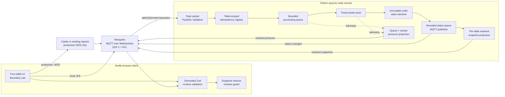
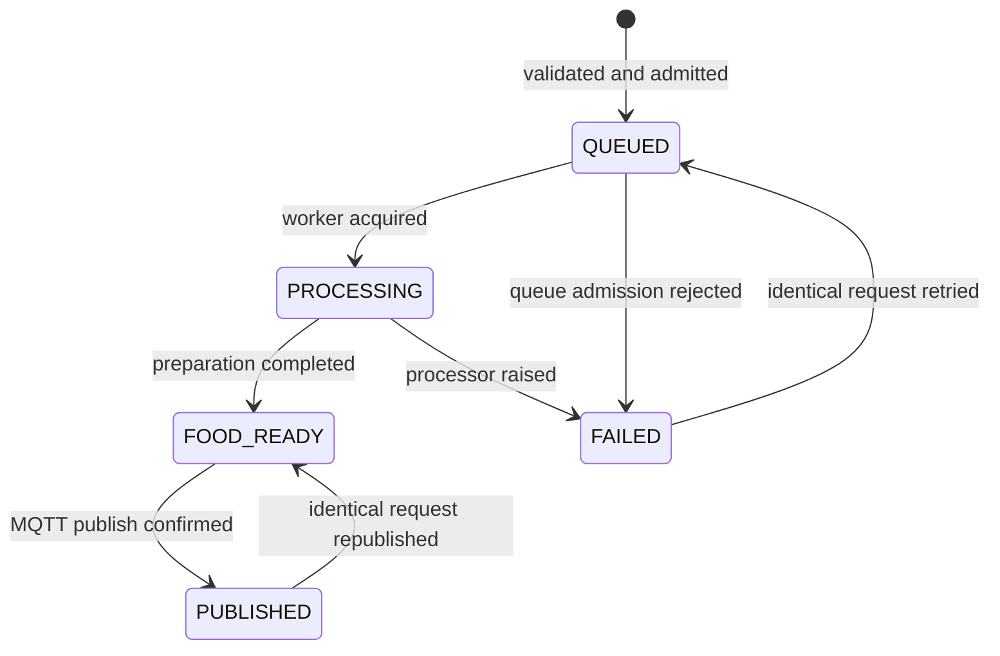

# OSENSA Restaurant Order System

An event-driven restaurant ordering system built with Svelte, TypeScript,
Python `asyncio`, and MQTT over WebSockets. Four tables can place orders
concurrently, observe each order move through the kitchen in real time, and
recover completed orders after closing and reopening the page.

There is no REST API. All application traffic is expressed as versioned MQTT
events.

## What is included

- A four-table ordering UI with free-text food orders and live lifecycle updates.
- A Python async backend with a bounded producer-consumer queue and worker pool.
- An explicit, immutable order state machine and QoS 1 idempotency handling.
- Retained table snapshots that restore missed order updates after a page refresh.
- Live queue depth and per-worker telemetry.
- A browser-based Boundary Lab for burst, idempotency, saturation, and overload tests.
- Pydantic-owned wire contracts with generated Zod schemas and TypeScript types.
- Per-table, console, and backend MQTT authorization roles.
- Local Docker Compose for zero-configuration WS testing.
- A production deployment reference with authenticated Mosquitto, WSS termination,
  hardened containers, secrets, health checks, and log rotation.
- Unit, contract, real-Broker integration, load, browser-MQTT, and ACL isolation tests.

## Architecture



### Event flow

1. The browser validates an order with the generated Zod contract and publishes
   it to that table's request topic.
2. Mosquitto applies the authenticated client's topic ACL before routing it.
3. The backend validates both the topic and payload, including that their table
   IDs agree.
4. The idempotency registry decides whether to process, ignore, retry, republish,
   reject a conflict, or reject new work at capacity.
5. An admitted order enters a bounded `asyncio.Queue`. One fixed worker owns it
   until processing completes or fails.
6. The state reducer authorizes every transition. Public status events are
   published only from valid internal states.
7. The backend publishes the status plus an authoritative retained table
   snapshot. The browser applies only newer snapshot revisions.

### MQTT topics

All application messages use QoS 1.

| Topic                                           | Producer                           | Consumer                             | Retained |
| ----------------------------------------------- | ---------------------------------- | ------------------------------------ | -------- |
| `restaurant/v1/table/{id}/order/requested`      | Table client or restaurant console | Backend                              | No       |
| `restaurant/v1/table/{id}/order/status-changed` | Backend                            | Matching table or restaurant console | No       |
| `restaurant/v1/table/{id}/snapshot`             | Backend                            | Matching table or restaurant console | Yes      |
| `restaurant/v1/kitchen/pressure`                | Backend                            | Restaurant console                   | Yes      |

The topic is part of the authorization boundary, not merely a routing hint. A
Table 1 credential cannot order for Table 4, read Table 4 state, or forge a
backend status event.

## Order lifecycle



`PUBLISHED` is an internal delivery-confirmation state. The public protocol
exposes `queued`, `processing`, `food_ready`, and `failed`.

The reducer returns a new immutable state for every valid transition and rejects
invalid or repeated transitions. This keeps concurrency correctness independent
from whichever task happens to deliver an MQTT message.

## Run locally

### Prerequisites

- Docker with the Compose plugin
- Node.js with Corepack
- Python 3.12 and [`uv`](https://docs.astral.sh/uv/) for tests and contract generation

### Start the Broker and backend

From the repository root:

```sh
docker compose up --build --wait
```

The default Compose stack exposes Mosquitto only on
`ws://127.0.0.1:9001/mqtt`. This development listener intentionally allows
anonymous access and is bound to loopback. It must not be exposed to the
internet.

### Start the frontend

In another terminal:

```sh
cd frontend
corepack pnpm install
corepack pnpm dev
```

Open `http://localhost:5173`. The frontend connects to
`ws://localhost:9001/mqtt` automatically.

Use the Broker settings dialog to override the endpoint. HTTPS pages require a
`wss://` endpoint. The endpoint is persisted in local storage; production
credentials are kept only for the current browser session.

Stop the local stack with:

```sh
docker compose down
```

## Explore the system

The **Restaurant** panel provides the required four-table workflow. Each table
can place one order or publish ten random orders concurrently.

The **Boundary Lab** makes backend behavior visible and repeatable:

- **Random burst** publishes a contract-valid concurrent batch across tables.
- **Idempotency jitter** sends the same UUID three times and expects one lifecycle.
- **Sustained saturation** uses live telemetry to hold the queue near a target load.
- **Overload and ghost guard** forces explicit admission failures, quarantines
  rejected IDs, and proves that rejected work never executes later.

The draggable **Kitchen pressure** monitor shows queue utilization, configured
capacity, and the current state of every worker.

## Production-readiness

The assignment explicitly asks for testing, edge-case handling, error handling,
logging, security, and documentation. The table below maps each requirement to
an implementation rather than treating "production ready" as a label.

| Concern                 | Implementation                                                                                                                                                                                                                           |
| ----------------------- | ---------------------------------------------------------------------------------------------------------------------------------------------------------------------------------------------------------------------------------------- |
| Concurrency             | A producer-consumer design separates MQTT intake from a fixed worker pool. Each admitted order is owned by one worker.                                                                                                                   |
| Backpressure            | The processing queue, incoming MQTT queue, status queue, registry, snapshots, and Broker queues all have explicit bounds.                                                                                                                |
| Overload                | Queue or registry exhaustion produces a structured `failed` event with code `service_overloaded` and `retryable: true`; rejected orders never become ghost work.                                                                         |
| Delivery semantics      | MQTT QoS 1 provides at-least-once delivery. A table-scoped `(tableId, orderId)` registry makes duplicates safe and detects conflicting payload reuse.                                                                                    |
| State correctness       | A pure reducer enforces the immutable order state machine. Invalid transitions and mismatched food results fail without mutating the current state.                                                                                      |
| Recovery                | Per-table retained snapshots restore the ten most recent orders after refresh or a closed browser session. Revisions reject stale snapshots; a service-instance ID distinguishes backend restarts.                                       |
| Contract safety         | Strict Pydantic models reject unknown fields, wrong types, invalid UUIDs, untrimmed/oversized names, unsupported schema versions, and naive timestamps.                                                                                  |
| Cross-stack consistency | An allowlisted generator exports backend JSON Schema into committed Zod schemas and inferred TypeScript types. `contract:check` detects drift.                                                                                           |
| Error handling          | Invalid untrusted messages are logged and ignored; valid orders receive explicit lifecycle failures. Processor exceptions do not kill workers. Frontend send, connection, validation, and retryable backend errors are shown separately. |
| Broker failures         | The backend reconnects with bounded exponential backoff. A pending status is retained in memory until the publish sequence completes, so reconnect retries are safe under idempotency.                                                   |
| Logging                 | Backend logs use stable event names and key-value context including order, table, worker, state, queue depth, topic, and reconnect delay. Caddy emits JSON access logs.                                                                  |
| Observability           | A retained pressure projection exposes queue depth, capacity, worker occupancy, revision, and service instance to the live UI.                                                                                                           |
| Security                | Production disables anonymous access, uses hashed Broker passwords, enforces least-privilege topic ACLs, validates topic/payload agreement, terminates WSS, checks browser Origin, and uses HSTS.                                        |
| Runtime hardening       | Production services use read-only filesystems where practical, non-root backend execution, `no-new-privileges`, memory/PID limits, health checks, restart policies, pinned images, and bounded log rotation.                             |
| Documentation           | This README documents architecture, operation, security, verification, trade-offs, and explicit non-goals. Deployment details live in `deploy/README.md`.                                                                                |

### Backpressure and capacity

Defaults are deliberately configurable:

| Environment variable               | Default | Purpose                                      |
| ---------------------------------- | ------: | -------------------------------------------- |
| `ORDER_WORKER_COUNT`               |     `8` | Maximum simultaneously processing orders     |
| `ORDER_QUEUE_CAPACITY`             |   `256` | Orders waiting for a worker                  |
| `ORDER_REGISTRY_CAPACITY`          |  `4096` | Idempotency/state entries retained in memory |
| `MQTT_INCOMING_QUEUE_CAPACITY`     |  `1024` | Defensive aiomqtt inbound-message bound      |
| `MQTT_RECONNECT_DELAY_SECONDS`     |     `1` | Initial backend reconnect delay              |
| `MQTT_RECONNECT_MAX_DELAY_SECONDS` |    `30` | Maximum reconnect delay                      |
| `LOG_LEVEL`                        |  `INFO` | Backend log verbosity                        |

The registry refuses to evict active orders. At capacity it evicts the oldest
terminal entry, or rejects admission if no terminal entry is available.

### Errors and edge cases

The automated suites cover, among other cases:

- malformed JSON and schema-invalid payloads;
- unknown fields, wrong primitive types, invalid table IDs, and oversized names;
- request-topic and payload-table mismatches;
- concurrent orders across all four tables;
- duplicate active, failed, completed, and republished orders;
- the same UUID used independently by different tables;
- conflicting payload reuse without mutation of the original order;
- processor exceptions and cancellation;
- full processing and registry queues;
- ordered status publication and retained snapshot recovery;
- stale, duplicate, regressive, and cross-table frontend updates;
- anonymous login, invalid credentials, cross-table reads/writes, and forged status events;
- hundred-order bursts, sustained overload, and post-rejection ghost-work detection.

Malformed messages cannot always receive a response because their identity may
itself be invalid. They are therefore rejected at the boundary and logged
without poisoning subsequent traffic. Once an order is valid and identifiable,
admission and processing failures use the public `failed` event.

## Contract generation

Pydantic is the source of truth for public MQTT DTOs. Only models explicitly
listed in `backend/app/models.py` under `CODEGEN_TARGETS` can cross into the
frontend contract.

Generate or verify the committed Zod/TypeScript output:

```sh
cd frontend
corepack pnpm install
corepack pnpm contract:gen
corepack pnpm contract:check
```

Generated files must not be edited manually. The generated schemas are also
tested with representative valid and invalid messages.

## Verification

### Fast local checks

```sh
cd backend
uv run pytest
uv run ruff check .
uv run ruff format --check .

cd ../frontend
corepack pnpm contract:check
corepack pnpm check
corepack pnpm lint
corepack pnpm test
corepack pnpm build
```

The current fast suites contain 125 passing backend tests and 63 passing
frontend tests. Broker-dependent suites are skipped unless explicitly enabled.

### Real MQTT round trip

With the development Compose stack running:

```sh
cd backend
RUN_MQTT_INTEGRATION=1 \
  uv run pytest tests/integration/test_mqtt_flow.py
```

This exercises real WebSocket MQTT traffic, concurrent lifecycles, malformed
messages, idempotency, conflicts, retained recovery, and pressure telemetry.

Run the longer burst and saturation cases:

```sh
RUN_MQTT_INTEGRATION=1 RUN_MQTT_LOAD=1 \
  uv run pytest tests/integration/test_mqtt_flow.py -m load
```

Run the real frontend MQTT client suite:

```sh
cd frontend
corepack pnpm exec playwright install chromium
VITE_RUN_MQTT_INTEGRATION=1 corepack pnpm test:mqtt
```

The production ACL suite is in
`backend/tests/integration/test_mqtt_acl.py`. It requires an authenticated
production Broker and is opt-in with `RUN_MQTT_SECURITY=1`.

## Security model

Development and production intentionally have different trust boundaries.

### Local development

- Anonymous WS is enabled for a zero-configuration reviewer experience.
- The listener is published only on `127.0.0.1`.
- This configuration is for local validation only.

### Production reference

- Anonymous clients are rejected.
- Credentials are generated randomly; Mosquitto stores only password hashes.
- `table-1` through `table-4` can publish requests and read state only for their table.
- `restaurant-console` can operate all four tables but cannot publish backend events.
- `restaurant-backend` can consume all requests and is the only role that can
  publish status, snapshots, and kitchen pressure.
- Caddy terminates WSS and applies an exact frontend-Origin allowlist.
- Broker and backend credentials are mounted as read-only file-backed secrets.
- Mosquitto is not directly exposed to the public network.

The WebUI Broker dialog uses the `restaurant-console` identity for the
four-table demonstration. A customer-facing single-table terminal should use
its corresponding `table-N` identity and should not expose the Boundary Lab.

The default Docker Compose command is intentionally local WS only. Public WSS
cannot be universally one-click because certificate issuance, DNS ownership,
public ports, and any existing ingress are deployment-specific. A standalone
Caddy/Mosquitto production reference is provided in
[`deploy/README.md`](deploy/README.md); a host that already owns port 443 should
reuse that ingress instead of starting a second public proxy.

## Design decisions and trade-offs

### Why QoS 1 instead of QoS 2?

QoS 1 is broadly supported and keeps transport behavior understandable, but it
permits duplicates. The explicit idempotency registry makes that delivery model
safe. QoS 2 would add protocol overhead without removing the need for
application-level conflict handling and restart semantics.

### Why one status-event union?

`queued`, `processing`, `food_ready`, and `failed` are variants of one
discriminated `OrderStatusChanged` contract. Consumers subscribe once and still
receive exhaustive, type-safe status-specific fields. Separate success and
failure topics would fragment one lifecycle without improving isolation.

### Why retained snapshots instead of browser persistence?

Local storage would preserve only what one browser had already seen. Retained
Broker snapshots let a newly opened clean-session client recover orders that
completed while no page was connected. Snapshots are bounded to ten orders per
table so the demo stays useful and memory cannot grow without limit.

### Why an explicit queue instead of only a semaphore?

A semaphore limits concurrent processors but leaves waiting work implicit and
difficult to observe or reject. A bounded queue gives `queued` a truthful
meaning, defines an admission boundary, enables worker telemetry, and makes
overload behavior testable.

## Known limits and next steps

The assignment explicitly permits in-memory state. This implementation keeps
that constraint visible rather than pretending to provide durability:

- A backend restart intentionally clears order state and replaces retained
  snapshots with a new service-instance baseline.
- Idempotency does not survive a backend restart.
- The service is designed as one backend instance. Horizontal scaling would
  require MQTT shared subscriptions plus a durable, atomic idempotency/state store.
- Static Broker credentials are appropriate for this controlled demo. A larger
  system would add automated rotation, short-lived client identities, and audit trails.
- Logs and pressure telemetry are operationally useful but are not a full metrics,
  tracing, alerting, or dead-letter pipeline.
- The frontend currently ships as one relatively large route chunk; code splitting
  would be the next performance cleanup.
- Durable order history, cancellation, kitchen prioritization, and multi-restaurant
  tenancy are intentionally outside this assignment.

For a durable production evolution, the first additions would be a transactional
order store, durable idempotency keys, an outbox for status publication, shared
subscriptions for horizontal workers, Prometheus/OpenTelemetry instrumentation,
and automated credential rotation.

## Repository layout

```text
backend/
  app/                    asyncio service, contracts, state machine, projections
  tests/unit/             deterministic domain and service tests
  tests/integration/      real MQTT flow, load, recovery, and ACL tests
frontend/
  scripts/                Pydantic JSON Schema to Zod generator
  src/lib/generated/      committed generated MQTT contracts
  src/lib/                MQTT client, reducers, Boundary Lab, UI components
deploy/
  caddy/                  WSS ingress reference
  mosquitto/              development and production Broker policies
  init-production-secrets.sh
compose.yaml              loopback-only local WS stack
compose.production.yaml   authenticated, hardened standalone production overlay
```
